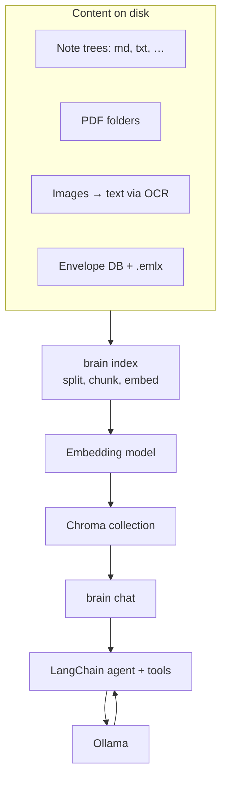

# Second Brain

Second Brain is a command-line app that runs entirely on the local machine. It indexes local notes, PDFs, screenshots, and Apple Mail into a vector store on disk, then offers a terminal chat where a language model answers questions by reading that indexed material. Chat uses **Ollama** on the same machine. By default, nothing is sent to a hosted chat API.

---

## Capabilities

Questions can be asked in everyday language over indexed files. Data remains on disk on the Mac; mail is read from Apple’s local mail folder at `~/Library/Mail`, not from IMAP. Chat also exposes small built-in tools, such as search, todos, and writing notes to folders listed in an explicit allowlist. Safer defaults for those tools are described under **Security** near the end of this file.

---

## Architecture

The flow is **sources → index → embeddings → vector store → chat → Ollama**. Indexing prepares searchable vectors; chat retrieves excerpts and asks the model to answer from them.



**`brain index`** writes one Chroma collection named `brain`. **`brain chat`** runs a LangChain agent on **Ollama**; the main retrieval tool is **`search_knowledge`**. **`source_scope`** narrows search to `mail`, `notes`, `pdfs`, `screenshots`, or `any`.

Mail chunks include **`date_unix`** so time phrases like “last 7 days” can filter results. After mail indexing logic changes—or if the index predates that field—run **`brain index --full`** once so stored metadata matches the app.

---

## Retrieval pipeline

`search_knowledge` delegates to **`brain/retrieval.py`**. Flags and limits live in **`brain/default_config.py`** (`hybrid_retrieval`, `hybrid_bm25_*`, `rerank`, `rerank_*`, `parent_context`, …).

1. **Vector candidates**: **`similarity_search`** on the query with the active metadata filter. The candidate count is `min(retrieve_k, 400)` so later stages stay bounded.

2. **Hybrid lexical pass**: If **`hybrid_retrieval`** is on, the store is scanned in pages with **`store.get`** up to **`hybrid_bm25_max_chunks`** rows matching the same filter. Each chunk is scored by **token overlap** between query and body. That is a **bounded-sample** lexical ranker, not a global BM25 index over the whole collection. The top **`hybrid_bm25_top_k`** lexical hits are merged with the vector list.

3. **Dedup**: Rows are deduplicated by **`chunk_id`**, or by **`source` + `chunk_index`** when **`chunk_id`** is missing.

4. **Rerank**: If **`rerank`** is on, **`sentence_transformers.CrossEncoder`** scores **(query, chunk text)** pairs. The model name is **`rerank_model_name`**; load failures skip reranking. Scores are sorted descending; the list is reordered accordingly.

5. **Top‑k cut**: Keep at most **`rerank_top_k`** documents before expansion.

6. **Parent / child context**: If **`parent_context`** is on and **`parent_context_window`** is positive, for each surviving hit the store loads chunks with the same **`source`** metadata, sorts by **`chunk_index`**, keeps indices within **`± window`**, and **concatenates** those bodies with `---` separators into one excerpt per hit. Loads are capped by **`parent_context_max_chunks_per_source`**.

With **`hybrid_retrieval`** off, steps 2 and the lexical merge are skipped; vector candidates still pass through dedup, optional rerank, top-k, and parent expansion.

---

## Example prompts

These work well in **`brain chat`** after a successful **`brain index`**.

| Aim | Example line |
| --- | --- |
| Notes | “What do my notes say about *budget*?” |
| PDFs | “Search my PDFs for *contract termination clause*.” |
| Screenshots | “What did that screenshot about *AWS billing* say?” |
| Mail, topic | “Summarize emails about *OpenAI*.” |
| Mail, window | “Summarize my email from the last 7 days.” |
| Mail, senders | “Categorize all email senders.” — or — “Who emailed me the most?” |

Built-in chat commands: **`/sources`** lists paths from the last retrieval; **`/quit`** exits.

---

## Prerequisites

- **Python 3.11+**
- **[Ollama](https://ollama.com/)** running locally with at least one model pulled, e.g. `ollama pull llama3.2`. On macOS, use [ollama.com/download](https://ollama.com/download) or **Homebrew** (`brew install ollama`), then start the service before pulling a model.
- **macOS** for Apple Mail paths under `~/Library/Mail`.
- **[Tesseract](https://github.com/tesseract-ocr/tesseract)** on `PATH` if screenshot text should be read from images.

---

## Install and first run

From the repo root, create a virtualenv once (or use `python3 -m venv .venv --clear` to recreate).

```bash
python3 -m venv .venv
source .venv/bin/activate
pip install -e ".[dev]"
```

Run **`brain`** from the same directory where optional **`config.py`** should load. That file is local-only and is not in git.

Typical first sequence:

```bash
brain doctor
brain index
brain chat
```

---

## The `brain` commands

| Command | Role |
| --- | --- |
| **`brain doctor`** | Validates merged config, probes **Ollama**, loads the embedding model once, checks the Chroma persist directory, and reports optional pieces (Tesseract, Apple Mail envelope DB). Exits non-zero if required checks fail. |
| **`brain index`** | **Incremental** ingest: re-embeds changed or new files, updates mail when the envelope fingerprint changes, skips unchanged files tracked in the index state DB. Prints JSON counts. |
| **`brain index --full`** | Clears index sidecar state first, then **re-chunks and re-embeds everything**. Use after mail or retrieval-related config changes, or when the index should be rebuilt from scratch. |
| **`brain chat`** | Interactive terminal chat: each turn can call **retrieval + tools** then **Ollama**. Uses **`/sources`** and **`/quit`** as built-ins. |

---

## Configuration

Default settings live in **`brain/default_config.py`** as **`CONFIG`**. Adding **`config.py`** at the project root shallow-merges another **`CONFIG`** on top. Keys must match **`AppConfig`** in **`brain/app_config.py`**; unknown keys fail at startup. **`load_config()`** produces the merged, typed config for all commands.

---

## Repository layout

| Path | Role |
| --- | --- |
| `brain/` | CLI, ingest, indexing, retrieval, chat, tools |
| `brain/default_config.py` | Default **`CONFIG`** |
| `brain/app_config.py` | Merge, validate, **`AppConfig`** |
| `config.py` | Local overrides |
| `pyproject.toml` | Package metadata; installs the **`brain`** script |
| `tests/` | **`pytest`** suite |

---

## Privacy and Hugging Face

Indexed documents, mail, and chat text are **not** uploaded to Hugging Face. **Public** embedding (and optionally rerank) weights download from the **Hugging Face Hub** on first use into a **local cache**; later runs are mostly disk-bound unless the cache is cleared or model names in config change.

Those downloads align with commands that touch embeddings: **`brain doctor`** (smoke embed), **`brain index`** (chunk embedding), **`brain chat`** (query embedding for search). Chat **answers** come from **Ollama** locally. Indexed vectors live under the configured Chroma path; default **`~/.brain/chroma`**. Set **`HF_TOKEN`** if the Hub warns about anonymous rate limits.

---

## Apple Mail

Indexing reads **`~/Library/Mail`**. **Full Disk Access** may be required for **Terminal** or **Cursor** in **System Settings → Privacy & Security**. If **`brain doctor`** shows no mail index, open Mail, sync, then run **`brain index --full`**.

Recent messages are preferred up to **`mail_message_limit`**. **`mail_only_inbox: true`** limits to inbox-style mailboxes when the database supports the join. After substantive mail-ingest changes, run **`brain index --full`** once.

---

## Security

**`write_note`** only writes under **`notes_write_allowlist`**. **`open_calendar`** runs only if **`open_calendar_enabled`** is true in config. Secrets and machine-specific paths belong in **`config.py`**, not **`brain/default_config.py`**.

---

## Development

**`pytest`** from the repo root. **`ruff check brain tests`** for lint; **`pyright brain tests`** for types.
